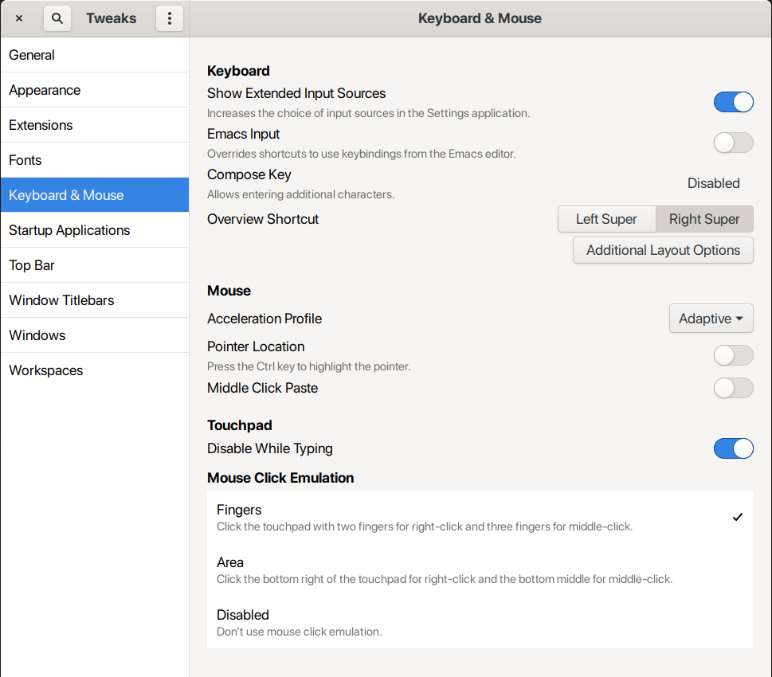
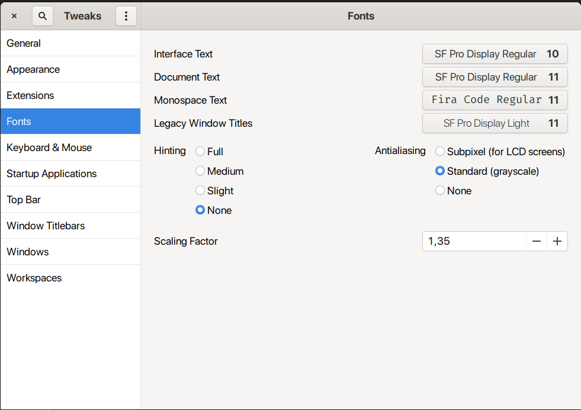
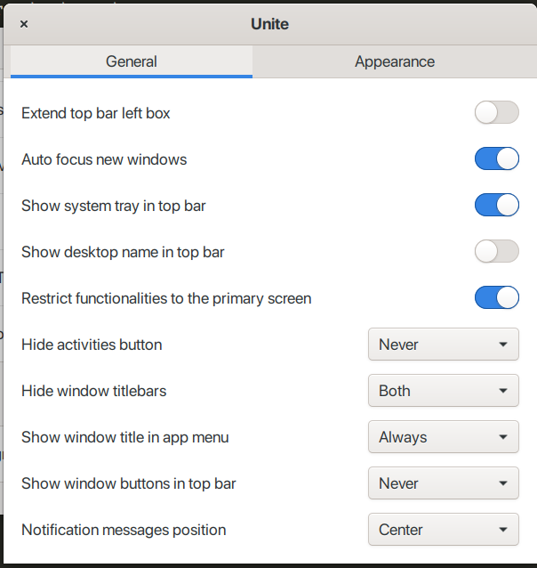
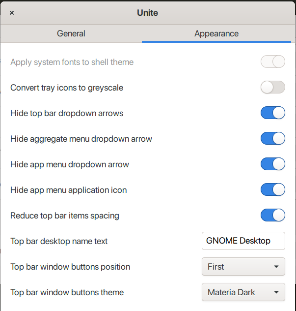

# Fedora Setup Plan

## Install linux

## Setup keyboard

### Tune keyboard in tweaks



```sh
gsettings set org.gnome.desktop.input-sources xkb-options "['lv3:ralt_switch', 'grp:caps_toggle', 'ctrl:swap_lalt_lctl_lwin', 'shift:breaks_caps', 'altwin:prtsc_rwin']"
```

### Disable hotkeys to apps run from the dash

```sh
gsettings set org.gnome.shell.keybindings switch-to-application-1 []
gsettings set org.gnome.shell.keybindings switch-to-application-2 []
gsettings set org.gnome.shell.keybindings switch-to-application-3 []
gsettings set org.gnome.shell.keybindings switch-to-application-4 []
gsettings set org.gnome.shell.keybindings switch-to-application-5 []
gsettings set org.gnome.shell.keybindings switch-to-application-6 []
gsettings set org.gnome.shell.keybindings switch-to-application-7 []
gsettings set org.gnome.shell.keybindings switch-to-application-8 []
gsettings set org.gnome.shell.keybindings switch-to-application-9 []
```

### Setup keybindings

#### Dump from previos linux

```sh
dconf dump /org/gnome/desktop/wm/keybindings/ > wm-keybindings.dconf.bak
dconf dump /org/gnome/settings-daemon/plugins/media-keys/ > media-keys-keybindings.dconf.bak
```

#### or use already dumped

[media-keys-keybindings.dconf.bak](files/keybindings/media-keys-keybindings.dconf.bak)
[wm-keybindings.dconf.bak](files/keybindings/wm-keybindings.dconf.bak)

```sh
dconf load /org/gnome/desktop/wm/keybindings/ < wm-keybindings.dconf.bak
dconf load /org/gnome/settings-daemon/plugins/media-keys/ < media-keys-keybindings.dconf.bak
```

### Setup layouts

Place to `/usr/share/X11/xkb/symbols/` files:

#### RUU (Russian-Ukrainian United keyboard layout)

Russian with belarussian symbols in 3rd layout and disables alt button to be able to set alt button to layout changing

[BY-RU layout](files/keyboard_layouts/ru)

#### English (US, IBM Arabic 238_L)

English with point and comma as in Russian

[EN](files/keyboard_layouts/us)

## Setup terminal

Save:

```sh
dconf dump /org/gnome/terminal/ > gnome-terminal.properties
```

or use:

[gnome-terminal.properties](files/configs/gnome-terminal.properties)

Install:

```sh
cat gnome-terminal.properties | dconf load /org/gnome/terminal/
```

## Setup fonts

### Install fonts

- [Better fonts](https://github.com/silenc3r/fedora-better-fonts)
- Fira Code (from store)
- Microsoft Core Fonts
- Saved fonts to ~/.fonts

### Tune fonts in tweaks



## Auto insall/remove apps

[Script](post-install-script/init.sh)

```sh
cd post-install-script
bash ./init.sh
```

[App lists folder](post-install-script)

## Manually install apps

- Docker
- asdf
- anydesk (`sudo dnf --releasever=32  install pangox-compat` before, then `systemctl disable anydesk`)
- appimage launcher
- microsoft teams
- skype
- viber
- joplin
- insomnia
- another redis desktop manager

### Setup zsh & ohmyzsh

```sh
sudo dnf install zsh util-linux-user
chsh -s /bin/zsh
rm ~/.bash_history ~/.bash_logout
```

Then install ohmyzsh

## Setup apps

### Gedit

Save:

```sh
dconf dump /org/gnome/gedit/ > gedit.properties
```

or use:

[gedit.properties](files/configs/gedit.properties)

Install:

```sh
cat gedit.properties | dconf load /org/gnome/gedit/
```

## Gnome extensions

- Unite




- Appindicator support
- Night theme switcher
- Remove accessibility

## Change pointer size (for scaling 1.35x)

```sh
dconf write /org/gnome/desktop/interface/cursor-size 35
```

or set cursor size in accessibility settings

## Change key repeat delay

Settings submenu "Accessibility-Typing-Repeat Keys"

## Set up profile picture

[userpic](files/pictures/userpic.jpg)
